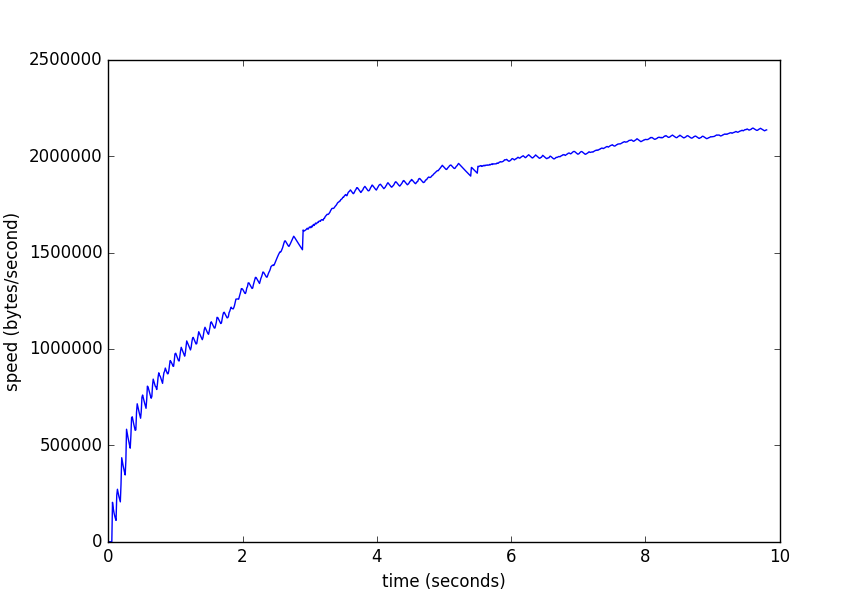

## What is it?

Some code to check that TCP indeed has slow start

## How to run it?

On `remote_host` run:

```shell
$ yes data | nc -l 1234
```

On local host run:

```shell
$ TSS_HOST=remote_host TSS_PORT=1234 python client.py
```

## Results

